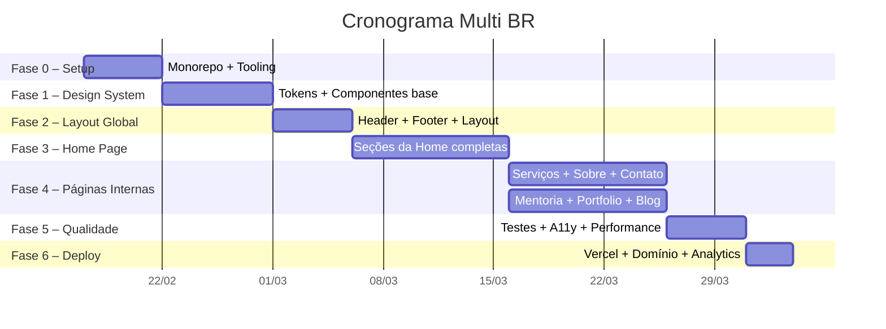
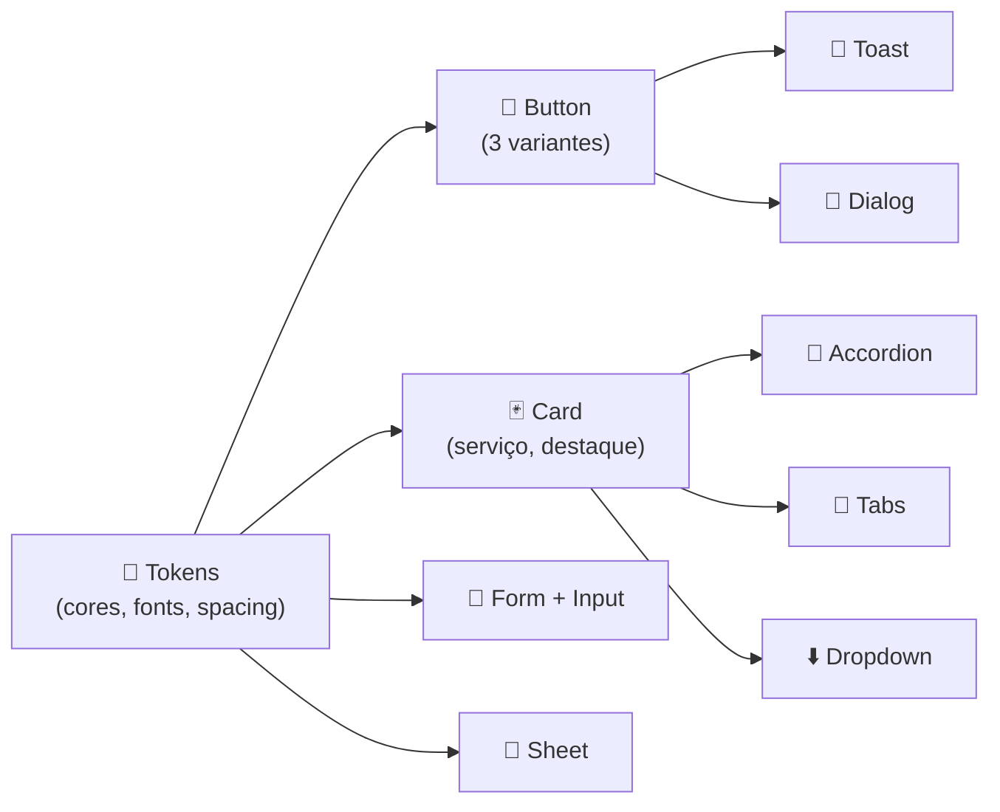

# 📋 Plano de Implementação — Agência Multi BR

> **Versão:** 1.0 · **Data:** Fevereiro 2026
> **Documentos-base:** `arquitetura.md`, `briefing_multi_br v0.1.md`, `DESIGN-SYSTEM.md`

---

## 1. Sumário Executivo

O projeto **Multi BR** consiste na criação do site institucional da Agência Multi BR, uma agência de marketing digital do Rio de Janeiro com foco em Branding, Conteúdo e Tráfego. O site servirá como principal canal de conversão da agência, captando leads tanto para os serviços B2B (tráfego pago, criação de conteúdo, design, etc.) quanto para os produtos digitais B2C (mentoria e e-book para profissionais de social media e agências iniciantes).

A arquitetura é baseada em **monorepo** com **Next.js 15** (App Router), **React 19**, **TypeScript 5**, **Tailwind CSS 3** e **shadcn/ui**, usando **Bun** como runtime/package manager, **Biome** para lint/format e **Turborepo** para orquestração de builds. O deploy será na **Vercel** com integração via **GitHub Flow** e CI via **GitHub Actions**.

O design system define uma identidade visual vibrante — paleta de 7 cores (roxo `#5D018A` como principal, amarelo `#FAC32A` para CTAs), tipografia com Balgin Black para headlines e Poppins para corpo, e um conjunto de 10+ componentes reutilizáveis. O site possui 8 páginas principais (Home, Sobre, Serviços×6, Mentoria, E-book, Portfolio, Blog, Contato) com forte estratégia de conversão em múltiplos pontos do funil.

O impacto esperado é a profissionalização da presença digital da agência, com metas de **2–5% de taxa de conversão** sobre visitantes, **10–15% CTR** no hero, e posicionamento como referência educacional no mercado de agências do RJ.

### Stack Tecnológico

| Camada | Tecnologia | Versão |
|--------|-----------|--------|
| Framework | Next.js (App Router) | 15.x |
| UI | React | 19.x |
| Linguagem | TypeScript (strict) | 5.x |
| Styling | Tailwind CSS + shadcn/ui | 3.x + latest |
| Runtime/PM | Bun | 1.x |
| Lint/Format | Biome | Latest |
| Build | Turborepo | Latest |
| Testes | Vitest + Testing Library + Playwright | Latest |
| Deploy | Vercel | — |
| CI | GitHub Actions | — |

---

## 2. Estrutura de Fases (WBS)



---

### Fase 0 — Setup Inicial

| | Detalhe |
|--|---------|
| **Objetivo** | Monorepo funcional com toda a toolchain configurada e pronta para desenvolvimento |
| **Duração** | 5 dias úteis |
| **Dependências** | Nenhuma (ponto de partida) |
| **Entregas** | Repositório GitHub com monorepo, Bun workspaces, Turbo, Biome, TypeScript strict, Next.js 15 rodando com `bun dev` |

---

### Fase 1 — Design System (Tokens + Componentes Base)

| | Detalhe |
|--|---------|
| **Objetivo** | Tokens visuais implementados e componentes atômicos prontos para composição |
| **Duração** | 7 dias úteis |
| **Dependências** | Fase 0 concluída |
| **Entregas** | `tailwind.config.ts` com tokens, `globals.css` com variáveis, fontes carregadas, shadcn/ui instalado com 10 componentes customizados, Storybook opcional |

---

### Fase 2 — Layout Global

| | Detalhe |
|--|---------|
| **Objetivo** | Estrutura de layout compartilhada por todas as páginas |
| **Duração** | 5 dias úteis |
| **Dependências** | Fase 1 (componentes Button, Sheet, Dropdown) |
| **Entregas** | Header responsivo com nav sticky, Footer completo, Layout wrapper com SEO base, Menu mobile (Sheet), WhatsApp floating button, estados de loading/error globais |

---

### Fase 3 — Home Page

| | Detalhe |
|--|---------|
| **Objetivo** | Página principal completa com todas as 8 seções do funil |
| **Duração** | 10 dias úteis |
| **Dependências** | Fase 2 (layout funcional) |
| **Entregas** | Hero, Serviços (6 cards), Mentoria (destaque), Portfolio (grid), Depoimentos, Blog highlights, CTA/Conversão final, integração com layout |

---

### Fase 4 — Páginas Internas

| | Detalhe |
|--|---------|
| **Objetivo** | Todas as páginas do site implementadas |
| **Duração** | 10 dias úteis (paralelizáveis) |
| **Dependências** | Fase 3 (componentes reutilizáveis da Home) |
| **Entregas** | Sobre, 6× Serviço individual (template), Portfolio/Cases, Blog (lista + post), Mentoria (landing), E-book (estrutura), Contato (formulário) |

---

### Fase 5 — Qualidade e Otimização

| | Detalhe |
|--|---------|
| **Objetivo** | Site testado, acessível e performático |
| **Duração** | 5 dias úteis |
| **Dependências** | Fases 3 e 4 concluídas |
| **Entregas** | Testes unitários (Vitest), testes E2E (Playwright) para fluxos críticos, auditoria a11y, Core Web Vitals otimizados, SEO meta tags, schema markup |

---

### Fase 6 — Deploy e Go-Live

| | Detalhe |
|--|---------|
| **Objetivo** | Site em produção no domínio agenciamultibr.com |
| **Duração** | 3 dias úteis |
| **Dependências** | Fase 5 (qualidade validada) |
| **Entregas** | Projeto Vercel configurado, domínio customizado, env vars, GitHub Actions CI, preview deploys, Vercel Analytics habilitado |

---

## 3. Tarefas Detalhadas por Fase

### Fase 0 — Setup Inicial

| # | Tarefa | Descrição | Prioridade | Est. | Deps |
|---|--------|-----------|-----------|------|------|
| 0.1 | Criar repositório GitHub | Repo `multi-br` com branch protection em `main`, template PR | 🔴 Alta | 1h | — |
| 0.2 | Inicializar monorepo com Bun | `package.json` raiz com workspaces `apps/*` + `packages/*` | 🔴 Alta | 2h | 0.1 |
| 0.3 | Configurar Turborepo | `turbo.json` com pipelines `dev`, `build`, `test`, `lint`, `type-check` | 🔴 Alta | 2h | 0.2 |
| 0.4 | Criar app Next.js 15 | `apps/web` com App Router, TypeScript strict, path aliases | 🔴 Alta | 3h | 0.2 |
| 0.5 | Instalar e configurar Biome | `biome.json` na raiz com regras de lint + format, integrar VSCode | 🔴 Alta | 2h | 0.2 |
| 0.6 | Configurar TypeScript | `tsconfig.json` raiz + workspace com strict mode, path aliases `@/` | 🔴 Alta | 1h | 0.4 |
| 0.7 | Criar package `packages/ui` | Workspace para componentes compartilhados com `package.json` | 🟡 Média | 2h | 0.2 |
| 0.8 | Criar package `packages/config` | Configurações compartilhadas (Tailwind, TS) | 🟡 Média | 1h | 0.2 |
| 0.9 | Criar package `packages/types` | Types compartilhados (`Service`, `BlogPost`, etc.) | 🟡 Média | 1h | 0.2 |
| 0.10 | Configurar Vitest | `vitest.config.ts` + Testing Library + mocks | 🟡 Média | 2h | 0.4 |
| 0.11 | Configurar Playwright | `playwright.config.ts` com Chromium, Firefox, WebKit | 🟢 Baixa | 2h | 0.4 |
| 0.12 | Validar `bun dev` funcional | Smoke test: Next.js rodando, Biome passando, TS sem erros | 🔴 Alta | 1h | 0.1–0.6 |

---

### Fase 1 — Design System

| # | Tarefa | Descrição | Prioridade | Est. | Deps |
|---|--------|-----------|-----------|------|------|
| 1.1 | Instalar Tailwind CSS 3 | Setup com `postcss.config`, `tailwind.config.ts` | 🔴 Alta | 1h | F0 |
| 1.2 | Implementar tokens de cor | Paleta completa (7 brand + neutros) em Tailwind `extend.colors.multi` | 🔴 Alta | 2h | 1.1 |
| 1.3 | Implementar CSS variables | `:root` com `--multi-color-*`, `--multi-gradient-*`, `--multi-font-*` em `globals.css` | 🔴 Alta | 1h | 1.1 |
| 1.4 | Carregar fontes customizadas | Balgin Black (local `@font-face`) + Poppins (next/font/google, pesos 400–700) | 🔴 Alta | 3h | 1.1 |
| 1.5 | Configurar escala tipográfica | Tokens de font-size, line-height, font-weight no Tailwind para H1–Caption | 🔴 Alta | 2h | 1.4 |
| 1.6 | Implementar tokens de espaçamento | `extend.spacing` com escala base-4px (12 tokens) | 🟡 Média | 1h | 1.1 |
| 1.7 | Implementar tokens de sombra | `extend.boxShadow` com 5 níveis (sm → whatsapp) | 🟡 Média | 1h | 1.1 |
| 1.8 | Implementar tokens de borda/raio | `extend.borderRadius` com sm/md/lg/full | 🟡 Média | 30min | 1.1 |
| 1.9 | Implementar gradientes como classes | Utility classes para 4 gradientes (principal, energético, profissional, overlay) | 🟡 Média | 1h | 1.2 |
| 1.10 | Inicializar shadcn/ui | `npx shadcn@latest init`, configurar tema com tokens Multi | 🔴 Alta | 2h | 1.2, 1.4 |
| 1.11 | Customizar Button (3 variantes) | Primário (amarelo), Secundário (outline), Ghost + estados (hover, disabled, loading) | 🔴 Alta | 3h | 1.10 |
| 1.12 | Customizar Card | Card de serviço, Card destaque (mentoria), com hover | 🔴 Alta | 2h | 1.10 |
| 1.13 | Customizar Form + Input + Textarea | Estilos de input, labels, validação (sucesso/erro) | 🔴 Alta | 3h | 1.10 |
| 1.14 | Adicionar Dialog/Modal | Overlay roxo, container branco, close button | 🟡 Média | 1h | 1.10 |
| 1.15 | Adicionar Sheet (menu mobile) | Slide da direita, overlay roxo | 🟡 Média | 1h | 1.10 |
| 1.16 | Adicionar Toast | 4 variantes (sucesso, erro, info, warning) com cores Multi | 🟡 Média | 1h | 1.10 |
| 1.17 | Adicionar Accordion | Para FAQs nas páginas de serviço e mentoria | 🟡 Média | 1h | 1.10 |
| 1.18 | Adicionar Tabs + Dropdown | Filtros e menus | 🟡 Média | 1h | 1.10 |
| 1.19 | Implementar animações base | Classes de `fade-in`, `slide-up`, `stagger` com IntersectionObserver | 🟡 Média | 3h | 1.1 |
| 1.20 | Escrever testes de tokens | Snapshot tests dos tokens (cores, fontes carregadas) | 🟢 Baixa | 2h | 1.2–1.9 |

---

### Fase 2 — Layout Global

| # | Tarefa | Descrição | Prioridade | Est. | Deps |
|---|--------|-----------|-----------|------|------|
| 2.1 | Criar `layout.tsx` raiz | Next.js root layout com fontes, metadata base, providers | 🔴 Alta | 2h | F1 |
| 2.2 | Desenvolver Header | Logo, nav links, CTA visível, background roxo, sticky ao scroll com blur | 🔴 Alta | 4h | 1.11, 1.15 |
| 2.3 | Desenvolver menu mobile | Sheet da direita com links de navegação, hamburguer toggle | 🔴 Alta | 3h | 2.2, 1.15 |
| 2.4 | Desenvolver Footer | Links rápidos, serviços, contato, redes sociais, CNPJ, copyright | 🔴 Alta | 3h | 1.11 |
| 2.5 | Criar WhatsApp floating button | Botão fixo `56×56px`, verde WhatsApp, z-999, link direto | 🟡 Média | 1h | 1.11 |
| 2.6 | Implementar skip-to-content | Link de acessibilidade no topo | 🟡 Média | 30min | 2.1 |
| 2.7 | Criar `loading.tsx` global | Skeleton/spinner com cores da marca | 🟡 Média | 1h | F1 |
| 2.8 | Criar `error.tsx` global | Error boundary com retry, mensagem amigável | 🟡 Média | 1h | F1 |
| 2.9 | Criar `not-found.tsx` | Página 404 com CTA para home | 🟢 Baixa | 1h | F1 |
| 2.10 | Configurar Metadata API | Template de metadata compartilhado, OG images, favicon | 🟡 Média | 2h | 2.1 |

---

### Fase 3 — Home Page

| # | Tarefa | Descrição | Prioridade | Est. | Deps |
|---|--------|-----------|-----------|------|------|
| 3.1 | Desenvolver Hero Section | ✅ Concluída: Headline Balgin "Branding ✹ Conteúdo ✹ Tráfego", estética Brasilidades (Colagem), ativos: Caju, Abacaxi, Pão de Açúcar, Pássaros. | 🔴 Alta | 6h | F2 |
| 3.2 | Desenvolver Serviços Overview | Grid 6 cards (2 col mobile, 3 col desktop), ícone + título + descrição + "Saiba mais" | 🔴 Alta | 4h | 1.12 |
| 3.3 | Desenvolver Seção Mentoria | Destaque full-width com fundo roxo/rosa, problema/solução 2 colunas, CTA forte | 🔴 Alta | 5h | 1.12 |
| 3.4 | Desenvolver Portfolio Grid | Grid de projetos destacados com imagem, título, categoria, hover effect | 🟡 Média | 4h | 1.12 |
| 3.5 | Desenvolver Depoimentos | Carrossel ou grid com foto, nome, empresa, citação, rating estrelas | 🟡 Média | 4h | 1.12 |
| 3.6 | Desenvolver Blog Highlights | 3 cards horizontais com imagem, categoria, título, excerpt, data, tempo leitura | 🟡 Média | 3h | 1.12 |
| 3.7 | Desenvolver CTA/Conversão Final | Multi-CTA 3 colunas (Serviços + Mentoria + Contato) sobre fundo gradiente | 🔴 Alta | 4h | 1.11 |
| 3.8 | Implementar Trust Badges | 3–4 badges inline (resposta 24h, sem compromisso, etc.) próximo aos CTAs | 🟡 Média | 1h | 3.1, 3.7 |
| 3.9 | Implementar scroll animations | Fade-in e slide-up nas seções ao entrar no viewport | 🟡 Média | 3h | 1.19 |
| 3.10 | Alternância de fundos | Garantir alternância branco/colorido entre seções conforme briefing | 🟡 Média | 1h | 3.1–3.7 |

---

### Fase 4 — Páginas Internas

| # | Tarefa | Descrição | Prioridade | Est. | Deps |
|---|--------|-----------|-----------|------|------|
| 4.1 | Criar página Sobre | História (ex-Bilhete), equipe, valores, processo, diferenciais | 🟡 Média | 4h | F2 |
| 4.2 | Criar template de Serviço | Template reutilizável: hero, descrição, benefícios, processo, entregas, FAQ (Accordion), CTA | 🔴 Alta | 6h | 1.17, F2 |
| 4.3 | Implementar 6 páginas de serviço | Tráfego, Conteúdo, Redes, Design, Sites, Identidade — populando template | 🟡 Média | 6h | 4.2 |
| 4.4 | Criar página Portfolio | Grid com filtro por tipo de serviço (Tabs), cards com hover | 🟡 Média | 4h | 1.18 |
| 4.5 | Criar página Blog (lista) | Grid de posts com imagem, categoria, título, excerpt, paginação | 🟡 Média | 4h | 1.12 |
| 4.6 | Criar template Blog Post | Layout de artigo com tipografia rich (prose), sidebar, share, posts relacionados | 🟡 Média | 4h | 4.5 |
| 4.7 | Criar página Mentoria | Landing completa: hero com dores, para quem, como funciona, módulos, credibilidade, depoimentos, CTA/formulário | 🔴 Alta | 6h | 1.13 |
| 4.8 | Criar página Contato | Formulário (nome, email, empresa, mensagem), WhatsApp, email, endereço, maps, redes | 🔴 Alta | 4h | 1.13 |
| 4.9 | Criar estrutura E-book | Landing page placeholder com countdown, preview, lead capture | 🟢 Baixa | 3h | 1.13 |
| 4.10 | Implementar rotas dinâmicas | `/servicos/[slug]` e `/blog/[slug]` com generateStaticParams | 🟡 Média | 3h | 4.2, 4.6 |

---

### Fase 5 — Qualidade e Otimização

| # | Tarefa | Descrição | Prioridade | Est. | Deps |
|---|--------|-----------|-----------|------|------|
| 5.1 | Escrever testes unitários | Componentes UI (Button, Card, Form), utils, hooks — meta 70%+ | 🔴 Alta | 6h | F3, F4 |
| 5.2 | Escrever testes de integração | Formulário de contato (validação + submit), navegação entre seções | 🔴 Alta | 4h | 5.1 |
| 5.3 | Escrever testes E2E | Fluxo completo: Home → Serviço → Contato (submit), Home → Mentoria | 🔴 Alta | 4h | 5.2 |
| 5.4 | Auditoria de acessibilidade | Executar Lighthouse a11y + axe-core, corrigir issues WCAG AA | 🔴 Alta | 4h | F4 |
| 5.5 | Otimizar Core Web Vitals | LCP < 2.5s, FID < 100ms, CLS < 0.1 — lazy loading, next/image, fonts | 🔴 Alta | 4h | F4 |
| 5.6 | Auditar SEO | Meta tags completas, heading hierarchy, schema markup, sitemap.xml, robots.txt | 🟡 Média | 3h | 2.10 |
| 5.7 | Revisar responsividade | Testar todos breakpoints (sm, md, lg, xl, 2xl) em todas as páginas | 🟡 Média | 3h | F4 |
| 5.8 | Revisar código (Biome) | Garantir zero warnings, imports organizados, sem console.log | 🟡 Média | 2h | F4 |

---

### Fase 6 — Deploy e Go-Live

| # | Tarefa | Descrição | Prioridade | Est. | Deps |
|---|--------|-----------|-----------|------|------|
| 6.1 | Criar projeto na Vercel | Conectar repo GitHub, configurar build command para monorepo | 🔴 Alta | 2h | F5 |
| 6.2 | Configurar variáveis de ambiente | `NEXT_PUBLIC_SITE_URL`, analytics IDs (production + preview) | 🔴 Alta | 1h | 6.1 |
| 6.3 | Criar CI pipeline (GitHub Actions) | Workflow `ci.yml` com jobs: biome check, type-check, test, build | 🔴 Alta | 3h | F5 |
| 6.4 | Configurar domínio customizado | `agenciamultibr.com` + `www.`, DNS, SSL automático | 🔴 Alta | 1h | 6.1 |
| 6.5 | Habilitar Vercel Analytics | Web Vitals, performance metrics, page views | 🟡 Média | 1h | 6.1 |
| 6.6 | Validar preview deploys | Testar PR com preview URL, verificar isolamento | 🟡 Média | 1h | 6.3 |
| 6.7 | Documentar README.md | Setup, comandos, estrutura, contributing guide, deploy workflow | 🟡 Média | 2h | F5 |
| 6.8 | Smoke test em produção | Verificar todas as páginas, formulários, links, responsividade | 🔴 Alta | 2h | 6.4 |

---

## 4. Matriz de Componentes do Design System

### Ordem de Implementação (caminho crítico)



### Prioridade de Tokens

| Prioridade | Token | Razão |
|-----------|-------|-------|
| 🔴 P0 | Cores (brand + neutros) | Tudo depende disso |
| 🔴 P0 | Fontes (Balgin + Poppins) | Sem fontes, nenhum componente fica pronto |
| 🔴 P0 | Border-radius | Afeta todos os componentes |
| 🟡 P1 | Espaçamento (base 4px) | Necessário para layout consistente |
| 🟡 P1 | Sombras (5 níveis) | Necessário para cards e elevação |
| 🟡 P1 | Gradientes (4) | Seções de conversão e destaque |
| 🟢 P2 | Transições (3 durações) | Polish, não bloqueia |
| 🟢 P2 | Animações de scroll | Última camada de polish |

### Dependências entre Componentes

| Componente | Depende de | Bloqueia |
|------------|-----------|----------|
| **Button** | Tokens (cores, fonts, radius) | Header, Hero, CTAs, Forms, Dialog, Toast |
| **Card** | Tokens | Serviços, Portfolio, Blog, Mentoria |
| **Form/Input** | Tokens, Button | Contato, Newsletter, Mentoria |
| **Sheet** | Button, Tokens | Menu mobile (Header) |
| **Toast** | Button, Tokens | Feedback de formulários |
| **Accordion** | Tokens | FAQ (Serviços, Mentoria) |
| **Tabs** | Tokens | Portfolio (filtros) |
| **Dialog** | Button, Tokens | Detalhes de serviço (opcional) |
| **Dropdown** | Button, Tokens | Menu de serviços (Header) |

---

## 5. Checklist de Arquitetura

### Ambiente de Desenvolvimento

- [ ] Bun instalado como runtime principal
- [ ] Monorepo inicializado com Bun workspaces
- [ ] `.nvmrc` ou equivalente para node version
- [ ] `.vscode/extensions.json` com Biome + Tailwind IntelliSense
- [ ] `.vscode/settings.json` com format on save via Biome

### Estrutura de Pastas

```
multi-br/
├── apps/
│   └── web/                    # Next.js 15
│       ├── app/
│       │   ├── layout.tsx
│       │   ├── page.tsx        # Home
│       │   ├── loading.tsx
│       │   ├── error.tsx
│       │   ├── not-found.tsx
│       │   ├── sobre/
│       │   ├── servicos/
│       │   │   ├── page.tsx
│       │   │   └── [slug]/
│       │   ├── mentoria/
│       │   ├── ebook/
│       │   ├── portfolio/
│       │   ├── blog/
│       │   │   ├── page.tsx
│       │   │   └── [slug]/
│       │   └── contato/
│       ├── components/
│       │   ├── layout/         # Header, Footer, WhatsApp
│       │   ├── marketing/      # Hero, CTA, Trust, Testimonials
│       │   └── ui/             # shadcn/ui customizados
│       ├── lib/
│       │   ├── utils.ts
│       │   └── api/            # Camada de abstração futura
│       └── public/
│           ├── fonts/          # Balgin Black
│           ├── logos/
│           └── images/
├── packages/
│   ├── ui/                     # Componentes compartilhados
│   ├── config/                 # Tailwind + TS configs
│   └── types/                  # Types compartilhados
├── biome.json
├── turbo.json
├── package.json
└── bun.lockb
```

- [ ] Estrutura de pastas criada conforme acima
- [ ] Path aliases `@/` configurados no `tsconfig.json`
- [ ] `next.config.js` com transpilePackages para monorepo

### Build Tools

- [ ] `turbo.json` com pipelines configuradas
- [ ] Biome instalado e `biome.json` na raiz
- [ ] Scripts no `package.json` raiz (`dev`, `build`, `test`, `lint`, `format`, `type-check`)
- [ ] Tailwind CSS + PostCSS configurados
- [ ] shadcn/ui inicializado com tema Multi

### Testes

- [ ] Vitest configurado com Testing Library
- [ ] Playwright configurado com 3 browsers
- [ ] Mocks de Next.js Router e Image
- [ ] Scripts: `bun test`, `bun test:watch`, `bun test:coverage`, `bun test:e2e`
- [ ] Primeiro teste smoke passando

### CI/CD

- [ ] `.github/workflows/ci.yml` criado
- [ ] Job 1: Biome check + TypeScript type-check
- [ ] Job 2: Vitest (unitários + integração) + coverage
- [ ] Job 3: Build test (turbo build)
- [ ] Branch protection: require PR, 1 review, CI verde
- [ ] Vercel GitHub integration ativa

### Documentação

- [ ] `README.md` com setup, comandos, estrutura
- [ ] `DESIGN-SYSTEM.md` ✅ (já criado)
- [ ] `CONTRIBUTING.md` com guidelines, git workflow, code review
- [ ] `PLANO-IMPLEMENTACAO.md` ✅ (este documento)

---

## 6. Registro de Riscos

| # | Risco | Prob. | Impacto | Mitigação |
|---|-------|-------|---------|-----------|
| R1 | **Fonte Balgin Black indisponível ou com licença restritiva** — a fonte "Balgin Black" é customizada e não está no Google Fonts. Se não houver arquivo `.woff2` disponível, a tipografia display fica comprometida. | 🟡 Média | 🔴 Alto | Confirmar disponibilidade do arquivo da fonte antes da Fase 1. Preparar fallback para uma display font open-source similar (ex.: Archivo Black, Bebas Neue). |
| R2 | **Conteúdo textual e imagens não prontos a tempo** — o plano assume que copy, fotos de equipe, cases de portfólio e depoimentos estarão disponíveis. Atrasos no conteúdo bloqueiam seções inteiras. | 🔴 Alta | 🔴 Alto | Usar placeholder content (lorem) durante desenvolvimento. Definir deadline de conteúdo 1 semana antes do go-live. Criar checklist de assets necessários por página. |
| R3 | **Complexidade do monorepo para equipe solo/pequena** — Turborepo + Bun workspaces + pacotes separados adicionam overhead de configuração desproporcional à equipe. | 🟡 Média | 🟡 Médio | Começar com estrutura simples (tudo em `apps/web`) e extrair pacotes `ui`, `types`, `config` somente quando o compartilhamento for necessário. Iniciar flat, refatorar depois. |
| R4 | **Performance de imagens do portfólio** — imagens pesadas de cases e projetos podem degradar Core Web Vitals, especialmente LCP. | 🟡 Média | 🟡 Médio | Usar `next/image` com formatos modernos (WebP/AVIF), placeholder blur, lazy loading. Definir tamanhos máximos e qualidade no `next.config.js`. |
| R5 | **Formulários sem backend** — o site será frontend-only inicialmente. Formulários de contato, newsletter e mentoria precisam de algum destino para os dados. | 🔴 Alta | 🟡 Médio | Implementar integração temporária via Formspree, Netlify Forms ou API Route do Next.js com envio de email (Resend/SendGrid). Documentar como futuro backend substituirá. |
| R6 | **Falta de depoimentos reais para seção Mentoria** — o programa de mentoria está em planejamento, portanto não haverá social proof real no lançamento. | 🔴 Alta | 🟡 Médio | Lançar com Variação 1 (Minimalista) sem social proof. Preparar componente para receber depoimentos futuros. Migrar para Variação 4 (Social Proof) quando disponível. |
| R7 | **Conflito Tailwind CSS v3 → v4** — Tailwind v4 pode ser lançado durante o desenvolvimento, criando tensão sobre quando migrar. | 🟢 Baixa | 🟡 Médio | Fixar Tailwind v3 no `package.json`. Migrar para v4 somente após estabilização, em um PR separado. |

---

## 7. Marcos (Milestones) e KPIs

### Milestones

| # | Marco | Critérios de Aceitação | Fase | Data-alvo |
|---|-------|----------------------|------|-----------|
| M1 | **🏗️ Ambiente Operacional** | `bun dev` roda Next.js 15, Biome passa, TypeScript compila, primeiro teste verde | F0 | Semana 1 |
| M2 | **🎨 Design System Funcional** | Todos os tokens implementados, 10 componentes shadcn customizados, fontes carregadas, visual match com DESIGN-SYSTEM.md | F1 | Semana 2 |
| M3 | **🏠 Home Page Completa** | 8 seções renderizando com layout responsivo, scroll animations, CTAs funcionais, mobile testado | F2+F3 | Semana 4 |
| M4 | **📄 Site Completo** | Todas as 8+ páginas implementadas, navegação funcional, formulários com validação client-side | F4 | Semana 6 |
| M5 | **✅ Qualidade Validada** | Testes passando (unit 70%+, E2E fluxos críticos), Lighthouse ≥90 (performance + a11y + SEO), WCAG AA compliance | F5 | Semana 7 |
| M6 | **🚀 Go-Live** | Site publicado em agenciamultibr.com, CI pipeline verde, preview deploys funcionando, Analytics ativo | F6 | Semana 8 |

### KPIs por Fase

| Fase | KPI | Meta |
|------|-----|------|
| F0 | Tempo de inicialização (`bun dev`) | < 3 segundos |
| F1 | Componentes customizados entregues | ≥ 10 |
| F2 | Score Lighthouse (layout only) | ≥ 95 (Performance) |
| F3 | Seções da Home renderizando corretamente | 8/8 |
| F4 | Páginas implementadas | 8+ (Home, Sobre, 6×Serviço, Mentoria, Portfolio, Blog, Contato) |
| F5 (testes) | Cobertura de testes unitários | ≥ 70% |
| F5 (a11y) | Issues WCAG AA | 0 critical, 0 serious |
| F5 (perf) | Core Web Vitals (LCP/FID/CLS) | Verde em todos |
| F6 | Tempo de build na Vercel | < 4 minutos |
| **Go-Live** | CTR do Hero CTA | 8–15% |
| **Go-Live** | Taxa de conversão geral | 2–5% |
| **Go-Live** | Scroll depth até footer | ≥ 60% |

---

## 8. Ferramenta de Gestão Sugerida

> [!TIP]
> **GitHub Projects** (Kanban board) é a melhor opção para este projeto por:
>
> - Integração nativa com o repo, PRs e Issues
> - Colunas: Backlog → Todo → In Progress → Review → Done
> - Labels por fase (F0–F6) e prioridade (P0–P2)
> - Milestones mapeados 1:1 com M1–M6
> - Sem custo adicional

### Labels Sugeridas

| Label | Cor | Uso |
|-------|-----|-----|
| `phase:0-setup` | Cinza | Tarefas de setup |
| `phase:1-design-system` | Roxo | Tokens e componentes |
| `phase:2-layout` | Azul | Header, Footer, Layout |
| `phase:3-home` | Rosa | Seções da Home |
| `phase:4-pages` | Laranja | Páginas internas |
| `phase:5-quality` | Verde | Testes, a11y, performance |
| `phase:6-deploy` | Amarelo | Deploy e go-live |
| `priority:critical` | Vermelho | Bloqueia avanço |
| `priority:high` | Laranja | Importante |
| `priority:medium` | Amarelo | Normal |
| `type:design-system` | Roxo | Componentes e tokens |

---

## 9. Gaps Identificados nos Documentos

> [!WARNING]
> Itens que precisam de definição antes ou durante a implementação.

| # | Gap | Documento | Impacto | Ação Sugerida |
|---|-----|-----------|---------|---------------|
| G1 | **Arquivo da fonte Balgin Black** não está especificado (local? licença?) | Briefing | Bloqueia F1.4 | Obter arquivo `.woff2` ou definir alternativa |
| G2 | **Fonte "Generic"** (marca) não tem especificação técnica | Briefing | Baixo (uso limitado ao logo) | Usar SVG para o logo em vez de font |
| G3 | **Conteúdo real das páginas** (copy, fotos, depoimentos) não existe nos docs | Briefing | Bloqueia go-live | Criar briefing de conteúdo separado com deadline |
| G4 | **Backend para formulários** não tem solução definida | Arquitetura | Bloqueia formulários funcionais | Definir solução temporária (Formspree, API Route + Resend) |
| G5 | **Cases de portfólio** — nenhum projeto listado com detalhes | Briefing | Bloqueia seção Portfolio | Coletar 3–6 cases com imagens, descrição e resultados |
| G6 | **Bahiana font** mencionada em conversas anteriores mas não no briefing | Histórico | Potencial conflito com Balgin | Esclarecer se Bahiana substitui ou complementa Balgin |
| G7 | **Dark mode** mencionado como "futuro" mas sem especificação | Arquitetura | Sem impacto imediato | Preparar CSS variables para facilitar dark mode futuro |

---

> **Manutenção:** Este plano deve ser atualizado ao final de cada fase com status real, lições aprendidas e ajustes de cronograma.
